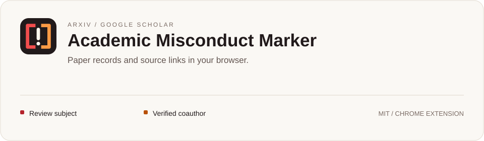

<p align="center"></p>

# Academic Misconduct Marker

**English** · [简体中文](README.zh-CN.md)

[](LICENSE)
[](https://github.com/ShipOfShame/Academic-Misconduct-Marker/releases/latest)
[](https://github.com/ShipOfShame/Academic-Misconduct-Marker/stargazers)
[](https://shipofshame.github.io/Academic-Misconduct-Marker/)

Academic Misconduct Marker adds source-linked paper and author markers to arXiv and Google Scholar. Hover to see the related papers; follow a link to the recorded issue and its evidence.

**[Download the extension](https://github.com/ShipOfShame/Academic-Misconduct-Marker/releases/latest)** · **[Browse the evidence](https://shipofshame.github.io/Academic-Misconduct-Marker/)** · [Report an issue](https://github.com/ShipOfShame/Academic-Misconduct-Marker/issues/new/choose)

[Review example](#review-example-sixun-dong-ironieser) · [Database](#which-papers-are-listed) · [Screenshots and markers](#what-the-icons-mean) · [Installation](#install) · [Identity matching](#how-identity-matching-works) · [References](#references-and-review-criteria)

[](evidence-database/papers/README.md)
[](https://shipofshame.github.io/Academic-Misconduct-Marker/)

## Review example: Sixun Dong (Ironieser)

<!-- case-summary:start -->
> **19 / 25 publicly listed papers (76%) have recorded open issues.**
>
> Snapshot: **2026-09-26**. The denominator is the [publication inventory](docs/publication-coverage.md) compiled from the author’s homepage and Google Scholar, including 4 papers awaiting full text.
<!-- case-summary:end -->

The recorded issues span multiple papers and include reporting inconsistencies, implementation defects and gaps in reproduction materials. This makes his publication record a useful case for checking research claims against papers and released materials.

### Findings in the papers

The current records include:

- [MMTok](evidence-database/papers/2508.18264.md): inconsistent performance metrics between the README and paper.
- [MLLM-Tool](evidence-database/papers/2401.10727.md): 184 released test inputs exactly match training inputs.
- [RoomDesigner](evidence-database/papers/2310.10027.md): shape-encoder validation uses the first five objects from the training list.

### Why this case

Sixun Dong, also known as Ironieser, lists multimodal learning, VLMs and LLM agents as his research areas. His [personal homepage](https://sixundong.com/) highlights publications at CVPR, NeurIPS, ICLR and ECCV.

His BanJev project prompted this review. An [earlier README](https://github.com/Ironieser/banjev/blob/34e08a0a38c5fa1ebf03e7716bb3396a2459a593/README.md#L15-L24) inferred from publication timing that authors were pursuing a trend and an early release rather than a research question. A [September 24, 2026 revision](https://github.com/Ironieser/banjev/commit/5fb4fe8c01d2601e19112244d5761d4d1d797782) replaced that wording with more neutral language.

The [reviewed rules](https://github.com/Ironieser/banjev/blob/4d9bca8947047e6d9b57957b6014466447960d9f/README.md#L48-L81) still score authors by time since model release and byline position to mark them and lower reading priority; the README describes the timing weights as heuristic and lacking direct validation against paper quality.

Researchers who publicly assess others' work should have their own work examined by the same standards. This project checks experimental reporting, data separation, released implementations and reproduction materials in his papers. The [references below](#references-and-review-criteria) explain the basis for those checks.

[](https://sixundong.com/)

## Which papers are listed

<!-- database-summary:start -->
As of **2026-09-26**, the database contains **19 papers and 33 open issues** in three categories:
<!-- database-summary:end -->

| Category | What the record identifies |
|---|---|
| Reporting inconsistency | Conflicting numbers, metric labels, equations, or public descriptions |
| Implementation issue | A specific defect in the released code or a mismatch with the described method |
| Material availability gap | Missing code, configurations, annotations, or other research materials |

Only papers with documented open issues enter the database. Each record gives the finding, reviewed version, source locations and relevant author responses. Corrected findings are removed from the active list.

Browse the [website](https://shipofshame.github.io/Academic-Misconduct-Marker/) or the [paper records](evidence-database/papers/README.md). Paper titles stay in their original English on both language routes.

## What the icons mean

| Icon | Meaning |
|---|---|
|  Red | A review subject linked to recorded paper issues |
|  Orange | A verified coauthor matched to the current page |
|  Gray | An unresolved or conflicting match for a review subject |
| Paper marker | The evidence record for that paper |


*The extension running on the [MMTok arXiv page](https://arxiv.org/abs/2508.18264). Other authors’ names are redacted.*


*The extension running on [Sixun Dong’s Google Scholar profile](https://scholar.google.com/citations?user=j71Y2-4AAAAJ&hl=en). Other authors’ names are redacted.*

## Install

1. Download the ZIP from the [latest release](https://github.com/ShipOfShame/Academic-Misconduct-Marker/releases/latest) and extract it.
2. Open `chrome://extensions` and enable **Developer mode**.
3. Click **Load unpacked** and select the extracted `extension` folder containing `manifest.json`.
4. Refresh arXiv or Google Scholar. Hover over a marker to view its paper and evidence links.

To update, replace the extension files, click **Reload** in Chrome's extension manager, and refresh the research page. [Detailed installation guide](docs/installation.md).

## How identity matching works

The extension matches papers by arXiv ID or exact title, then checks authors against curated identity records:

- Verified Google Scholar IDs and ORCIDs identify specific profiles. Paper bylines, affiliations and coauthors provide context; conflicting identifiers override a matching name.
- On a verified Scholar profile, the owner's name or initials in publication bylines use that profile ID, including papers outside the issue database.
- Coauthor markers require both a verified identity and a match to the current page.
- Paper evidence markers appear only on listed papers. Author hover cards link to that author's existing evidence records.

<!-- identity-summary:start -->
As of **2026-09-26**, the [identity audit](docs/identity-audit.md) covers **65 author records**. Among 64 coauthors, 48 have verified identity links, 11 have supporting evidence, and 5 remain unresolved. The 16 supported or unresolved coauthors receive no markers.
<!-- identity-summary:end -->

## Website and settings

The [website](https://shipofshame.github.io/Academic-Misconduct-Marker/) lets you search by paper, author, or arXiv ID, filter by issue type, and sort by review priority or date. You can adjust the category weights on the page. The [methodology](docs/methodology.md) explains the scoring and references.

The extension settings let you turn markers on or off, hide coauthor markers, and import or export a database. **Restore bundled evidence** switches back to the included records; export any custom data you want to keep first.

The extension uses bundled or manually imported data. Database updates arrive with extension releases. The interface is English; the website and README have separate English and Chinese versions. [Privacy](PRIVACY.md).

## Weekly source checks

[Weekly source review](https://github.com/ShipOfShame/Academic-Misconduct-Marker/actions/workflows/weekly-source-review.yml) runs every Monday at 04:17 UTC and can also be started manually. It checks publication pages, paper versions, code repositories, author responses and identity sources for changes. Each run produces a review list with links and the related papers and authors; unreviewed changes carry forward to the next run. The first run establishes a comparison baseline.

This workflow uses no AI API. Database findings and author verification are updated after the source changes have been reviewed. See [monitoring and review](docs/data-maintenance.md#weekly-source-monitor).

## Submit evidence or report a problem

[Open an issue](https://github.com/ShipOfShame/Academic-Misconduct-Marker/issues/new/choose) with the paper ID, the specific problem, and a source link pointing to the relevant table, equation, code lines, or author reply. For an identity mismatch, include the affected page and the correct public profile.

## References and review criteria

The following research and publication standards inform the specific checks used in this project.

1. **Pineau et al. (2021)**. [Improving Reproducibility in Machine Learning Research (A Report from the NeurIPS 2019 Reproducibility Program)](https://jmlr.org/papers/v22/20-303.html). JMLR, 22(164): 1–20. Code and experimental details should remain open to examination after publication. The NeurIPS program combined a code-submission policy, a reproducibility checklist and a community reproducibility challenge.

2. **Dodge et al. (2019)**. [Show Your Work: Improved Reporting of Experimental Results](https://aclanthology.org/D19-1224/). EMNLP-IJCNLP. Model comparisons require more than a final test score. The study shows how validation results and hyperparameter-search budgets can change the conclusions drawn from a comparison.

3. **Kapoor and Narayanan (2023)**. [Leakage and the reproducibility crisis in machine-learning-based science](https://doi.org/10.1016/j.patter.2023.100804). Patterns, 4(9): 100804. Data separation needs inspection throughout preprocessing, model development and evaluation. The paper analyzes leakage and its effects on scientific claims based on machine-learning results.

4. **Sandve et al. (2013)**. [Ten Simple Rules for Reproducible Computational Research](https://doi.org/10.1371/journal.pcbi.1003285). PLOS Computational Biology, 9(10): e1003285. Results should be traceable to inputs, software versions, parameters and analysis steps. This motivates our versioned source links and checks of reproduction materials.

5. **ACM**. [Artifact Review and Badging](https://www.acm.org/publications/policies/artifact-review-and-badging-current). Publication policy. Material availability, artifact functionality and independent validation of results are separate assessment dimensions. Our records identify which dimension a finding concerns.

6. **COPE**. [Core Practices — Post-publication discussions and corrections](https://publicationethics.org/core-practices). Publication-ethics guidance. Journals should provide mechanisms for discussion after publication and for correcting the research record. Our source-linked findings and correction process follow this principle.

[How the criteria are applied](docs/methodology.md).

<details>
<summary>Development and testing</summary>

Requires Node.js 22 or newer and Python 3 for packaging.

```sh
npm ci
npx playwright install chromium
npm run generate
npm run check
npm run test:e2e
npm run package
```

The canonical database is `evidence-database/database.json`. Chinese evidence text is stored separately in `evidence-database/locales/zh-CN.json`. Keep their source fingerprints in sync, then run `npm run generate` to update the website, paper records, and bundled extension data. See [data maintenance](docs/data-maintenance.md).

Edit the English page in `site/index.en.html` and interface translations in `locales/`. Run `npm run icons` after changing `extension/brand.js`. GitHub Pages serves `docs/` from `main`; checks run locally before publication.

[Validation notes](extension/VALIDATION.md)

</details>

## Project resources

[Changelog](CHANGELOG.md) · [Contributing](CONTRIBUTING.md) · [Privacy](PRIVACY.md) · [Security](SECURITY.md) · [Brand assets](docs/brand.md)

## License

[MIT](LICENSE). Third-party screenshots and linked materials retain their original rights.
