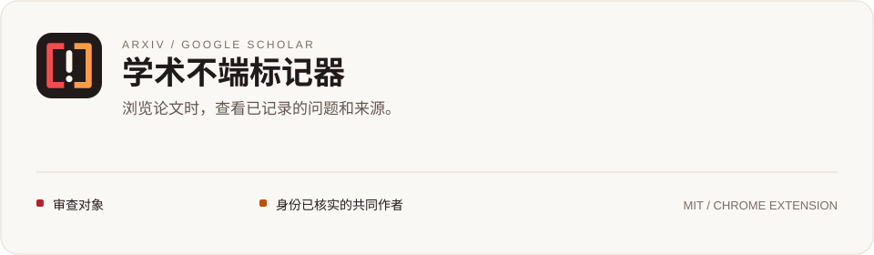
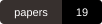
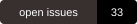
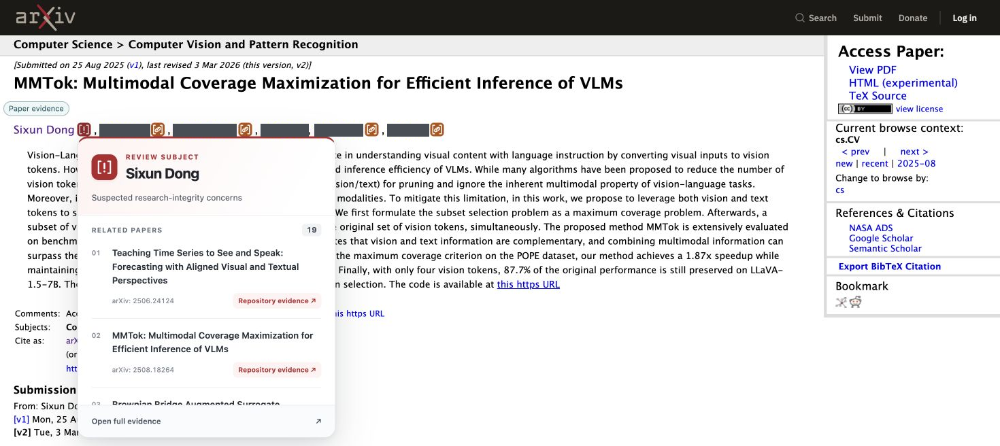
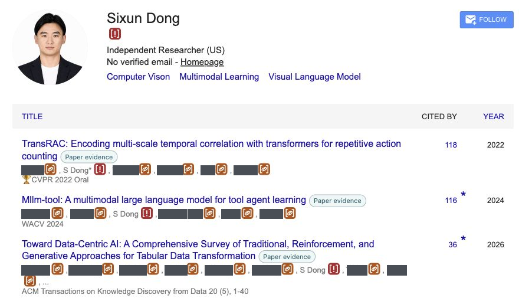

<p align="center"></p>

# 学术不端标记器

[English](README.md) · **简体中文**

[](LICENSE)
[](https://github.com/ShipOfShame/Academic-Misconduct-Marker/releases/latest)
[](https://github.com/ShipOfShame/Academic-Misconduct-Marker/stargazers)
[](https://shipofshame.github.io/Academic-Misconduct-Marker/zh/)

学术不端标记器在 arXiv 和 Google Scholar 上显示论文和作者标记。鼠标移到图标上，可以查看相关论文；点击链接，可以查看具体问题和证据来源。

**[下载扩展](https://github.com/ShipOfShame/Academic-Misconduct-Marker/releases/latest)** · **[查看证据](https://shipofshame.github.io/Academic-Misconduct-Marker/zh/)** · [反馈问题](https://github.com/ShipOfShame/Academic-Misconduct-Marker/issues/new/choose)

[审查案例](#审查案例sixun-dongironieser) · [数据库](#收录哪些论文) · [截图与标记](#图标表示什么) · [安装](#安装扩展) · [身份匹配](#如何匹配作者身份) · [参考文献](#参考文献与审查依据)

[](docs/zh/papers)
[](https://shipofshame.github.io/Academic-Misconduct-Marker/zh/)

## 审查案例：Sixun Dong（Ironieser）

<!-- case-summary:start -->
> **公开清单中的 25 篇论文，有 19 篇收录了未解决问题，占 76%。**
>
> 统计日期：**2026-09-26**。分母采用作者主页与 Google Scholar 合并后的[逐篇清单（英文）](docs/publication-coverage.md)，其中包含 4 篇待取得全文的论文。
<!-- case-summary:end -->

已记录的问题分布在多篇论文中，涉及报告不一致、实现缺陷和复现材料缺失。因此，本项目以其论文记录作为集中审查案例，逐篇对照论文主张与公开材料。

### 论文核查结果

目前收录的具体问题包括：

- [MMTok](docs/zh/papers/2508.18264.md)：README 与论文报告的性能指标不一致。
- [MLLM-Tool](docs/zh/papers/2401.10727.md)：公开测试集中有 184 条输入与训练输入完全相同。
- [RoomDesigner](docs/zh/papers/2310.10027.md)：形状编码器使用训练对象列表前五项进行验证。

### 为什么选择这个案例

Sixun Dong 的开发者昵称是 Ironieser。他在[个人主页](https://sixundong.com/)中将研究方向列为多模态学习、VLM 和 LLM Agent，并展示 CVPR、NeurIPS、ICLR、ECCV 等会议的发表记录。

这次审查起于他开发的 BanJev 项目。[旧版 README](https://github.com/Ironieser/banjev/blob/34e08a0a38c5fa1ebf03e7716bb3396a2459a593/README.md#L15-L24)曾根据论文在模型发布后出现的时间，推测作者是在追逐热点、抢先发表，而非回答研究问题。该措辞已在 [2026 年 9 月 24 日的修改](https://github.com/Ironieser/banjev/commit/5fb4fe8c01d2601e19112244d5761d4d1d797782)中改为较中性的表述。

[核查版本中的规则](https://github.com/Ironieser/banjev/blob/4d9bca8947047e6d9b57957b6014466447960d9f/README.md#L48-L81)仍按距模型发布的时间和作者位次计分，据此标记作者并降低其论文的阅读优先级；README 同时说明，这套时间权重属于经验设定，尚无直接衡量这一时间间隔与论文质量关系的研究支持。

公开评价他人研究质量的研究者，其自身论文也应接受同样的检查。本项目据此核查他的实验报告、数据划分、公开实现和复现材料。具体检查依据见[参考文献](#参考文献与审查依据)。

[](https://sixundong.com/)

## 收录哪些论文

<!-- database-summary:start -->
截至 **2026-09-26**，数据库包含 **19 篇论文、33 项未解决问题**，分为三类：
<!-- database-summary:end -->

| 类型 | 记录内容 |
|---|---|
| 报告不一致 | 数值、指标标签、公式或公开表述之间的差异 |
| 实现问题 | 公开代码中的具体缺陷，或代码与论文方法不一致 |
| 复现材料缺失 | 缺失的代码、配置、标注或其他研究材料 |

数据库只收录有具体未解决问题的论文。每条记录列出问题、核查版本、来源位置及相关作者回复。已纠正的问题移出当前列表。

可以在[中文网站](https://shipofshame.github.io/Academic-Misconduct-Marker/zh/)或[仓库证据目录](docs/zh/papers)中查看。中英文页面均保留论文英文原标题。

## 图标表示什么

| 图标 | 含义 |
|---|---|
|  红色 | 与已记录论文问题有关的审查对象 |
|  橙色 | 身份已核实，且与当前页面匹配的共同作者 |
|  灰色 | 审查对象的页面身份待核实，或身份标识存在冲突 |
| 论文标记 | 该论文的证据入口 |



*扩展在 [MMTok 的 arXiv 页面](https://arxiv.org/abs/2508.18264)上的实际效果，其他作者姓名已遮挡。*



*扩展在 [Sixun Dong 的 Google Scholar 主页](https://scholar.google.com/citations?user=j71Y2-4AAAAJ&hl=en)上的实际效果，其他作者姓名已遮挡。*

## 安装扩展

1. 从[最新版本](https://github.com/ShipOfShame/Academic-Misconduct-Marker/releases/latest)下载 ZIP 并解压。
2. 打开 `chrome://extensions`，启用「开发者模式」。
3. 点击「加载已解压的扩展程序」，选择包含 `manifest.json` 的 `extension` 文件夹。
4. 刷新 arXiv 或 Google Scholar 页面，将鼠标移到标记上查看论文和证据链接。

更新时替换扩展文件，在 Chrome 扩展管理页点击「重新加载」，再刷新论文页面。[详细安装说明（英文）](docs/installation.md)。

## 如何匹配作者身份

扩展通过 arXiv 编号或完整标题匹配论文，再结合身份记录识别作者：

- 已核验的 Google Scholar 账户 ID 和 ORCID 用于识别具体主页。论文署名、机构和合作者提供辅助信息；身份标识冲突优先于姓名匹配。
- 在已核实的 Scholar 主页上，论文署名中的主页作者姓名或缩写沿用该主页身份，论文未收录也会显示作者标记。
- 合作者标记需要同时满足身份已核实、与当前页面匹配两个条件。
- 论文证据标记只显示在已收录的论文上。作者悬停卡片链接到该作者已有的证据记录。

<!-- identity-summary:start -->
截至 **2026-09-26**，[身份核验记录（英文）](docs/identity-audit.md)包含 **65 位作者**。其中有 64 位合作者：48 位有已核实的身份联系，11 位有支持性证据，5 位仍待核实。这 16 位共同作者暂不标记。
<!-- identity-summary:end -->

## 网站与设置

[网站](https://shipofshame.github.io/Academic-Misconduct-Marker/zh/)支持按论文、作者或 arXiv 编号搜索，按问题类型筛选，按审查优先级或日期排序。页面中可以调整各类问题的权重。评分方式和参考文献见[审查方法](docs/zh/methodology.md)。

扩展设置中可以开关标记、隐藏合作者标记，以及导入或导出数据库。**Restore bundled evidence** 用于恢复内置记录；如果要保留自定义数据，请先导出。

扩展使用内置或手动导入的数据，内置数据库随扩展版本更新。扩展界面为英文，网站和 README 分别提供中英文版本。[隐私说明（英文）](PRIVACY.md)。

## 每周来源检查

[每周来源检查](https://github.com/ShipOfShame/Academic-Misconduct-Marker/actions/workflows/weekly-source-review.yml)在每周一 UTC 04:17 运行，也可以手动启动。任务检查论文列表、论文版本、代码仓库、作者回复和身份来源的变化，生成包含来源链接、相关论文和作者的待审清单。尚未处理的变化会保留到下次清单中。首次运行建立用于后续比较的记录。

此任务不调用 AI 服务。来源变化经审查后，再更新数据库中的问题记录和作者身份认定。维护方法见[来源检查与审查](docs/data-maintenance.md#weekly-source-monitor)。

## 提交证据或反馈问题

通过 [issue](https://github.com/ShipOfShame/Academic-Misconduct-Marker/issues/new/choose) 提供论文编号、具体问题和来源链接，并指出相关表格、公式、代码行或作者回复。身份匹配错误请附上出现问题的页面和正确的公开主页。

## 参考文献与审查依据

以下研究和出版规范分别对应本项目的具体审查要求。

1. **Pineau et al. (2021)**. [Improving Reproducibility in Machine Learning Research (A Report from the NeurIPS 2019 Reproducibility Program)](https://jmlr.org/papers/v22/20-303.html). JMLR, 22(164): 1–20. 论文发表后，代码和实验细节仍应接受核查。NeurIPS 的该计划包括代码提交政策、可复现性清单和社区复现挑战。

2. **Dodge et al. (2019)**. [Show Your Work: Improved Reporting of Experimental Results](https://aclanthology.org/D19-1224/). EMNLP-IJCNLP. 模型比较需要报告最终测试分数以外的信息。该研究说明，验证结果和超参数搜索预算会影响模型比较的结论。

3. **Kapoor and Narayanan (2023)**. [Leakage and the reproducibility crisis in machine-learning-based science](https://doi.org/10.1016/j.patter.2023.100804). Patterns, 4(9): 100804. 预处理、模型开发和评估环节都需要检查数据分离。该研究分析了数据泄漏及其对基于机器学习结果的科学结论的影响。

4. **Sandve et al. (2013)**. [Ten Simple Rules for Reproducible Computational Research](https://doi.org/10.1371/journal.pcbi.1003285). PLOS Computational Biology, 9(10): e1003285. 结果应能追溯到输入、软件版本、参数和分析步骤。这对应本项目对来源版本、实验配置和复现材料的检查。

5. **ACM**. [Artifact Review and Badging](https://www.acm.org/publications/policies/artifact-review-and-badging-current). Publication policy. 材料可用性、研究产物的功能完整性、结果的独立验证是不同的评估维度。本项目按具体问题分别记录。

6. **COPE**. [Core Practices — Post-publication discussions and corrections](https://publicationethics.org/core-practices). Publication-ethics guidance. 期刊应提供发表后讨论和更正研究记录的机制。本项目据此提供问题来源，并在问题得到纠正后更新记录。

具体检查方式见[审查方法](docs/zh/methodology.md)。

<details>
<summary>开发与测试</summary>

需要 Node.js 22 或更新版本；打包需要 Python 3。

```sh
npm ci
npx playwright install chromium
npm run generate
npm run check
npm run test:e2e
npm run package
```

主数据库位于 `evidence-database/database.json`，中文证据说明位于 `evidence-database/locales/zh-CN.json`。同步核对来源指纹后，运行 `npm run generate` 更新网站、证据页和扩展内置数据。具体操作见[数据维护说明（英文）](docs/data-maintenance.md)。

英文网页源文件位于 `site/index.en.html`，界面翻译位于 `locales/`。修改 `extension/brand.js` 后运行 `npm run icons`。GitHub Pages 从 `main` 分支的 `docs/` 发布，检查在发布前本地完成。

[验证记录（英文）](extension/VALIDATION.md)

</details>

## 项目资料

[更新日志](CHANGELOG.md) · [参与贡献](CONTRIBUTING.md) · [隐私说明](PRIVACY.md) · [安全问题](SECURITY.md) · [图标与视觉素材](docs/brand.md)

## 许可

[MIT](LICENSE)。第三方截图和链接材料保留各自的权利。
